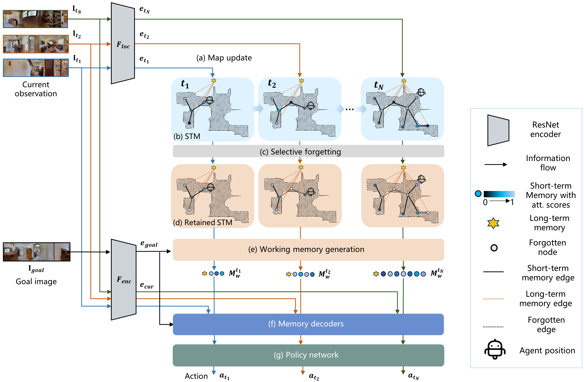

**MemoNav**: Working Memory Model for Visual Navigation
========

[](http://arxiv.org/abs/2402.19161) 
[](https://GitHub.com/Naereen/StrapDown.js/graphs/commit-activity) 

This repository is the official implementation of [MemoNav](https://arxiv.org/abs/2402.19161). 


<p align="center">

<br>
<b>MemoNav Icon</b>
</p>

## Requirements
The source code is developed and tested in the following setting. 
- Python 3.7
- pytorch 1.11.0+cu102
- habitat-sim 0.2.1
- habitat 0.2.1

Please refer to [habitat-sim](https://github.com/facebookresearch/habitat-sim.git) and [habitat-lab](https://github.com/facebookresearch/habitat-lab.git) for installation instructions.

To install requirements:

```setup
pip install -r requirements.txt
```

## Data Setup
The scene datasets and task datasets used for training should be organized in the habitat-lab directory as follows:
```
habitat-api (or habitat-lab)
  └── data
      └── datasets
      │   └── pointnav
      │       └── gibson
      │           └── v1
      │               └── train
      │               └── val
      └── scene_datasets
          └── gibson_habitat
              └── *.glb, *.navmeshs  
```

The single and multi-goal train/val/test datasets should be organized as follows:
```
This repo
  └── image-goal-nav-dataset
      |
      └── gibson
      |  └── train
      |  └── multi_goal_val
      |      └── 1goal
      |      │   └── *.json.gz
      |      └── 2goal
      |      │   └── *.json.gz
      |      └── 3goal
      |      │   └── *.json.gz
      |      └── 4goal
      |          └── *.json.gz
      |  
      └── mp3d/test
          └── 1goal
          └── 2goal
          └── 3goal
      
```

## MemoNav Pipeline


We employ three types of navigation
memory. The node features on a map are stored in **the short-term
memory (STM)**, as these features are dynamically updated.
A forgetting module then retains the informative
STM fraction to increase efficiency. We also introduce **long-term
memory (LTM)** to learn global scene representations
by progressively aggregating STM features. Subsequently, a
graph attention module encodes the retained STM and the
LTM to generate **working memory (WM)** which contains the
scene features essential for efficient navigation.

## Results

Our model achieves the following performance on:

### [Gibson single-goal test dataset](https://github.com/facebookresearch/image-goal-nav-dataset)
Following the experiemntal settings in VGM, our MemoNav model was tested on 1007 samples of this dataset. We reported the performances of our model and various baselines in the table. (NOTE: we re-evaluated the VGM pretrained model and reported new results)

| Model name         | SR  | SPL |
| ------------------ |---------------- | -------------- |
| VGM   |     70.0         |      55.4       |
| MemoNav (ours)   |     74.7         |      57.9       |

### Gibson multi-goal test dataset
We collected multi-goal test datasets in the Gibson scenes by randomly sample trajectories according to the rules specified in our paper.

| Model name         | 2goal PR  | 2goal PPL | 3goal PR  | 3goal PPL | 4goal PR  | 4goal PPL |
| ------------------ |---------------- | -------------- |---------------- | -------------- |---------------- | -------------- |
| VGM   |     42.9        |      17.1       | 29.5 | 7.0 | 21.5 | 4.1 |
| MemoNav (ours)   |     50.8         |      20.1       | 38.0 | 9.0 | 28.9 | 5.1 |

### MP3d multi-goal test dataset
We collected multi-goal test datasets in the MP3D scenes by converting the [Multi-ON dataset](https://shivanshpatel35.github.io/multi-ON/).

| Model name         | 1goal SR  | 1goal SPL | 2goal PR  | 2goal PPL | 3goal PR  | 3goal PPL |
| ------------------ |---------------- | -------------- |---------------- | -------------- |---------------- | -------------- |
| VGM   |     25.1       |      16.6      | 16.7 | 5.0 | 11.8 | 2.5 |
| MemoNav (ours)   |     26.1         |      16.3       | 19.5 | 5.6 | 13.6 | 2.9 |

### Visualizations


https://user-images.githubusercontent.com/49870114/175005380-b3623e2b-22e5-4e1f-88e3-7dc41fe3ddec.mp4


https://user-images.githubusercontent.com/49870114/175005417-7939a6f2-987f-431d-b5b2-abac1141cdfb.mp4


https://user-images.githubusercontent.com/49870114/175005441-871eb72c-a938-4086-a699-d9dd4d8857f5.mp4


https://user-images.githubusercontent.com/49870114/175005452-cb3f720d-4143-4000-a673-b4172945fdb3.mp4

# Citation
If you use the MemoNav agent and dataset, feel free to cite us.

```bibtex
@inproceedings{li2024memonav,
title={MemoNav: Working Memory Model for Visual Navigation},
author={Li, Hongxin and Wang, Zeyu and Yang, Xu and Yang, Yuran and Mei, Shuqi and Zhang, Zhaoxiang},
booktitle={Proceedings of the IEEE/CVF Conference on Computer Vision and Pattern Recognition},
year={2024}
}