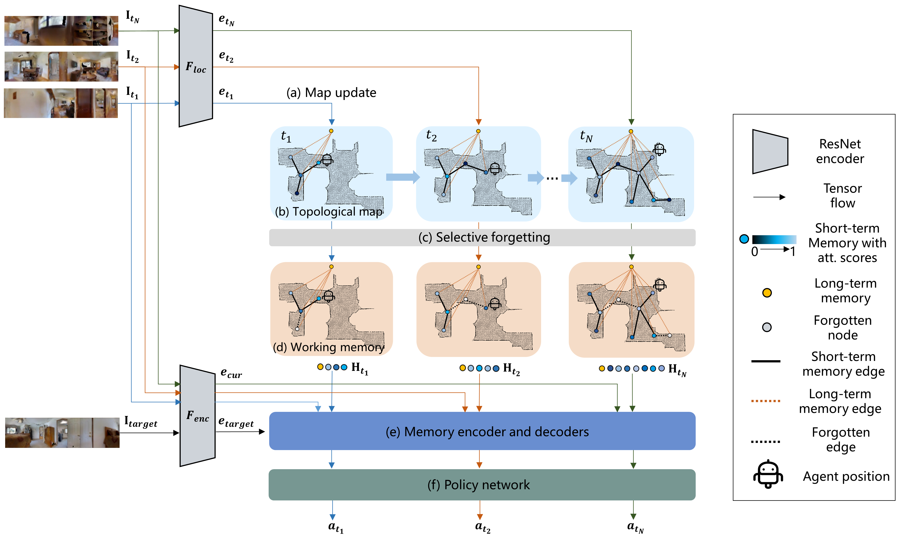

# MemoNav: Selecting Informative Memories for Visual Navigation

This repository is the official implementation of [MemoNav](https://arxiv.org/abs/2030.12345). 




## Requirements
The source code is developed and tested in the following setting. 
- Python 3.7
- pytorch 1.7.1
- habitat-sim 0.2.0
- habitat 0.2.1

Please refer to [habitat-sim](https://github.com/facebookresearch/habitat-sim.git) and [habitat-lab](https://github.com/facebookresearch/habitat-lab.git) for installation instructions.

To install requirements:

```setup
pip install -r requirements.txt
```

## Habitat Data Setup
The scene datasets and task datasets used for training should be organized in the habitat-lab directory as follows:
```
habitat-api (or habitat-lab)
  └── data
      └── datasets
      │   └── pointnav
      │       └── gibson
      │           └── v1
      │               └── train
      │               └── val
      └── scene_datasets
          └── gibson_habitat
              └── *.glb, *.navmeshs  
```

The single and multi-goal test datasets should be organized as follows:
```
This repo
  └── image-goal-nav-dataset
      └── val
      │   └── *.json.gz
      └── val_2goal
      │   └── *.json.gz
      └── val_3goal
      │   └── *.json.gz
      └── val_4goal
          └── *.json.gz
```

## Training
The MemoNav is trained for two phases as the VGM. We first train the agent using imitation learning, minimizing the negative log-likelihood of the ground-truth actions. Next, we finetune the agent’s policy with proximal policy optimization (PPO) to improve the exploratory ability of the agent.

### Imitation Learning
To train the model(s) in the paper via IL, run this command:

```train
python train_bc.py --config  ./configs/GATv2_EnvGlobalNode_Respawn_ILRL.yaml --stop
```

### Reinforcement Learning
To fintune the model(s) via RL, run this command:

```train
python train_rl.py --config  ./configs/GATv2_EnvGlobalNode_Respawn_ILRL.yaml --stop --diff hard
```

## Evaluation

To evaluate the model on the single-goal dataset, run:

```eval
python evaluate_dataset.py  --config ./configs/GATv2_EnvGlobalNode_Respawn_ILRL.yaml  --eval-ckpt ./data/new_checkpoints/GATv2_EnvGlobalNode_Respawn_ILRL_RL/*.pth --stop --diff hard --gpu 0,0 --forget --version <exp_name>

```

To evaluate the model on the multi-goal dataset, run:

```eval
python evaluate_dataset.py  --config ./configs/GATv2_EnvGlobalNode_Respawn_ILRL.yaml  --eval-ckpt ./data/new_checkpoints/GATv2_EnvGlobalNode_Respawn_ILRL_RL/*.pth --stop --diff 3goal --gpu 0,0 --forget --version <exp_name>

```


## Pre-trained Models

You can download pretrained models here:

- [Memonav model](https://zjueducn-my.sharepoint.com/:u:/g/personal/hongxin_li_zju_edu_cn/EVHGjFj4db9GiblAcCrTh1kBF78FpMW2-X7HUHrGsmXOZg?e=DSPnb5) trained on Gibson scene datasets. 

>📋  Give a link to where/how the pretrained models can be downloaded and how they were trained (if applicable).  Alternatively you can have an additional column in your results table with a link to the models.
## Results

Our model achieves the following performance on:

### [Gibson single-goal test dataset](https://github.com/facebookresearch/image-goal-nav-dataset)
Following the experiemntal settings in VGM, our MemoNav model was tested on 1007 samples of this dataset. We reported the performances of our model and various baselines in the table. (NOTE: we re-evaluated the VGM pretrained model and reported new results)

| Model name         | SR  | SPL |
| ------------------ |---------------- | -------------- |
| ANS   |     0.30         |      0.11       |
| Exp4nav   |     0.47         |      0.39       |
| SMT   |     0.56         |      0.40       |
| Neural Planner   |     0.42         |      0.27       |
| NTS   |     0.43         |      0.26       |
| VGM   |     0.75         |      0.58       |
| MemoNav (ours)   |     0.78         |      0.54       |

### [Gibson multi-goal test dataset](https://github.com/facebookresearch/image-goal-nav-dataset)
We compared our model with VGM on multi-goal test datasets which can be downloaded [here](https://zjueducn-my.sharepoint.com/:u:/g/personal/hongxin_li_zju_edu_cn/EWij85gdfT5GswDxZt5X14QBkXVEd9B-cFhr3kS0vbZ5SQ?e=Lz7zLo).

| Model name         | 2goal PR  | 2goal PPL | 3goal PR  | 3goal PPL | 4goal PR  | 4goal PPL |
| ------------------ |---------------- | -------------- |---------------- | -------------- |---------------- | -------------- |
| VGM   |     0.45        |      0.18       | 0.33 | 0.08 | 0.28 | 0.05 |
| MemoNav (ours)   |     0.50         |      0.17       | 0.42 | 0.09 | 0.31 | 0.05 |

### Visualizations
<iframe height=320 width=576 src="./assets/0096_Denmark_success=1.0_spl=0.2_step=218.0.mp4"></iframe>
<iframe height=192 width=288 src="./assets/waypoint_map_0096_Denmark_success=1.0_spl=0.2.mp4"></iframe>
<iframe height=320 width=576 src="./assets/0579_Scioto_success=1.0_spl=0.5_step=137.0.mp4"></iframe>
<iframe height=368 width=432 src="waypoint_map_0579_Scioto_success=1.0_spl=0.5.mp4"></iframe>

## Contributing

<!-- >📋  Pick a licence and describe how to contribute to your code repository. >📋  A template README.md for code accompanying a Machine Learning paper -->
